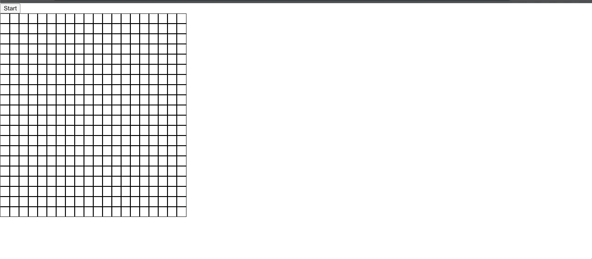

# Game of Life Simulation • 

  ## Table of Contents

1. [Description](#description)
2. [Deployed Site](#deployedsite)
2. [Technologies Used](#technologies)
3. [Installation](#installation)
4. [License](#license)
5. [Contributing](#contributing)
6. [Tests](#tests)
7. [Questions](#questions)

## [Description](#description)
This application allows the user to click individual cells and implements the rules for Conway's The Game of Life algorithm. 

## [Deployed Site](#deployedsite)
  https://bduran04.github.io/GOL/

 
 
## [Technologies Used](#technologies)
* React.js
* Javascript
* Immer library

## [Installation](#installation)
To install necessary dependencies, run the following command: npm install, then run the command, npm start to start the application 

## [License](#license)
This project is licensed under: 
[MIT](https://choosealicense.com/licenses/mit/)

## [Contributing](#contributing)
Reach out to me if you would like to contribute to the repo! 

## [Tests](#tests)
Tests through Jest in progress to ensure that the nextGeneration function works properly

## [Questions](#questions)
If you have questions, you can reach me at bduran04@gmail.com. You can find more of my work at [bduran04](https://github.com/bduran04)